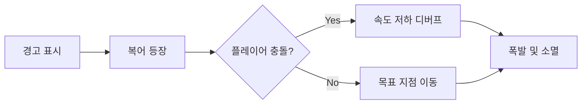
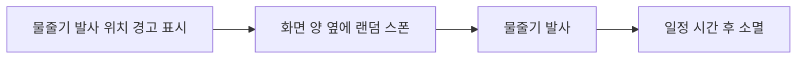
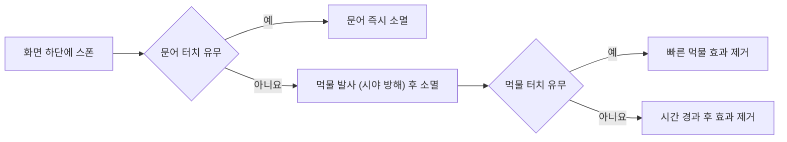
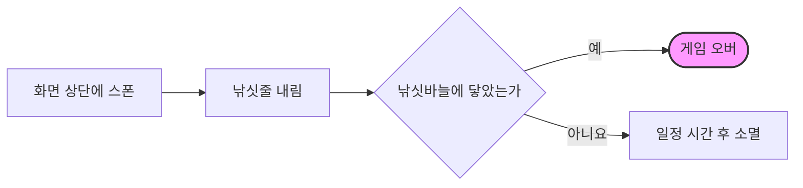

> 본 프로젝트는 **앱인토스(app-in-toss) 게임**으로 실제 출시된 **2D 하이퍼캐주얼 아케이드 게임** '크레용피쉬'의 클라이언트 및 웹 통합 모듈을 포트폴리오 용으로 리팩토링한 결과물 입니다. 단기 인턴십 과정에서 담당했던 **방해 요소 스폰 시스템**과 **WebGL Safe Area 대응** 로직을 포함하고 있습니다.

## 📌 Project Overview
<div align="center">
  <table>
    <tr>
      <th>개발 기간</th><td align="center">2025.06.30 ~ 2025.07.29 (1개월)</td>
    </tr>
    <tr>
      <th>개발 인원</th><td align="center">4명 (클라이언트 4)</td>
    </tr>
    <tr>
      <th>담당 역할</th><td align="center">Main Developer (방해 요소 시스템, WebGL 플랫폼 대응)</td>
    </tr>    
    <tr>
      <th>기술 스택</th>
      <td align="center">
        
        
        
      </td>
    </tr>    
    <tr>
      <th>타겟 플랫폼</th><td align="center">WebGL (Mobile Web Browser)</td>
    </tr>   
    <tr>
      <th>프로젝트 노션 페이지</th><td align="center"><a href="https://www.notion.so/Crayonfish-33a784b9ff71803bac98d449b6a71407?source=copy_link">크레용피쉬(CrayonFish) 노션 바로가기</a></td>
    </tr>
    <tr>
      <th>게임 플레이 페이지</th><td align="center"><a href="https://cham-qomop.itch.io/crayonfish">Itch.io에서 크레용피쉬 데모판 체험하기</a></td>
    </tr>
  </table>
</div>

## 🚀 Key Contributions
### 1. 확률 가중치 기반 방해 요소 스폰 시스템 
플레이어의 성장 속도에 맞춰 게임의 긴장감을 유지하기 위해 **레벨 데이터 기반 스폰 시스템**을 설계했습니다.
- **동적 난이도 조절:** `ObstacleSpawnLevelData`를 통해 레벨별 등장 확률(Weight)과 생성 주기(Interval)를 유연하게 관리합니다.
- **시스템 흐름도:**
  - **메인 스폰 시스템 흐름도:** <br>
    매 프레임 타이머를 체크하고, 플레이어 레벨에 따른 가중치 확률로 방해 요소를 생성하는 전체 프로세스입니다.
  ```mermaid
  graph LR
    Start[게임 시작] --> Init[카메라 및 초기 스폰 간격 설정]
    Init --> Update[Update: deltaTime 누적]
    
    Update --> CheckTimer{스폰 타이머 >= <br/>현재 간격?}
    CheckTimer -- 아니요 --> Update
    
    CheckTimer -- 예 --> Reset[타이머 초기화 및 <br/>다음 랜덤 간격 설정]
    Reset --> GetLevel[현재 플레이어 레벨 데이터 조회]
    
    GetLevel --> Weight{가중치 기반 <br/>랜덤 타입 선택}
    Weight -- 실패 --> Update
    Weight -- 성공 --> Spawn[해당 타입 프리팹 생성]
    
    Spawn --> Update
    
    style Weight fill:#fff4dd,stroke:#d4a017,stroke-width:2px
    style CheckTimer fill:#e1f5fe,stroke:#01579b,stroke-width:2px
  ```

  - **방해 요소별 위치 결정 로직:** <br>
    `GetSpawnPositionByType` 메서드 내에서 뷰포트(Viewport) 좌표를 활용해 화면의 상/하/좌/우 내부 위치를 계산하는 세부 로직입니다.
  ```mermaid
  graph LR
    A[위치 계산 시작] --> Type{방해 요소 타입?}
    
    Type -- Blowfish --> BF[화면 내부 랜덤<br/>Padding 5% 적용]
    Type -- Seahorse --> SH{50% 확률로<br/>좌측 또는 우측}
    Type -- Octopus --> OC[화면 하단<br/>X축 랜덤]
    Type -- Fisher --> FI[화면 상단<br/>X축 랜덤]
    
    BF & SH & OC & FI --> Convert[ViewportToWorldPoint<br/>월드 좌표 변환]
    Convert --> End([최종 좌표 반환])

    style Type fill:#fff4dd,stroke:#d4a017,stroke-width:2px
    style BF fill:#f1f8e9,stroke:#33691e
    style SH fill:#f1f8e9,stroke:#33691e
    style OC fill:#f1f8e9,stroke:#33691e
    style FI fill:#f1f8e9,stroke:#33691e
  ```

### 2. 방해 요소 4종 로직
> 각 방해 요소는 독립적인 상태 머신을 가지며, 플레이어와의 다양한 인터랙션을 제공합니다.

#### 🐡 복어(Blowfish) 구현 상세

| 구현 로직 및 특징 | 인게임 시연 (GIF) |
| :-------------: | :--------------: |
| **[경고 → 등장 → 폭발]** <br> 애니메이션 이벤트와 연동하여 경고 후 특정 지점으로 이동합니다. <br> 플레이어 충돌 시 둔화(속도 감소) 디버프를 부여합니다. |  |

#### ▽ 상세 흐름도 (Flowchart)


#### 🐴 해마(Seahorse) 구현 상세

| 구현 로직 및 특징 | 인게임 시연 (GIF) |
| :-------------: | :--------------: |
| **[물대포 물리 처리]** <br> `MaterialPropertyBlock`을 사용하여 셰이더 성능을 최적화했습니다. <br> `OnTriggerStay2D`를 이용해 플레이어를 밀어내는 물리 로직을 구현했습니다. |  |

#### ▽ 상세 흐름도 (Flowchart)


#### 🐙 문어(Octopus) 구현 상세

| 구현 로직 및 특징 | 인게임 시연 (GIF) |
| :-------------: | :--------------: |
| **[탭 인터랙션 기반 저지]** <br> 일정 시간 내에 플레이어가 지정된 횟수만큼 탭하지 않으면 화면 전체를 가리는 먹물을 발사합니다. |  |

#### ▽ 상세 흐름도 (Flowchart)


#### 🎣 낚시꾼(Fisher) 구현 상세

| 구현 로직 및 특징 | 인게임 시연 (GIF) |
| :-------------: | :--------------: |
| **[레벨 연동형 가변 로직]** <br> 플레이어 레벨에 비례하여 낚싯줄의 길이를 동적으로 조절합니다. <br> 게임 후반부로 갈수록 더 깊은 안전 구역을 위협합니다. |  |

#### ▽ 상세 흐름도 (Flowchart)


### 3. WebGL 플랫폼 최적화 (Safe Area) 
- **플랫폼 브릿지 구축:** `Jslib`와 `UnitySafeAreaController`를 연동하여 자바스크립트-C# 간 안정적인 양방향 통신 구현했습니다.
- **모바일 웹 사용자 경험 개선:** 다양한 기기(노치 디자인 등)에 대응하기 위해 런타임에서 뷰포트 기반 앵커를 자동 계산하여 UI 가림 현상을 해결했습니다.

## 📂 Project Structure (My Works)
본 리포지토리는 프로젝트 전체 코드 중 **직접 설계하고 구현한 핵심 시스템** 위주로 구성되어 있습니다.
```Plaintext
Assets/
 ├── Assets-Showcase/
 ├── Client-Scripts/
 │    ├── Managers/         
 │    │    └── ObstaclesManager.cs # 확률 기반 스폰 및 플레이어 레벨 데이터 관리
 │    └── Obstacles/        
 │         ├── Combat/
 │         │    ├── Blowfish.cs # 복어: 상태 머신 기반(경고/이동/폭발) 로직
 │         │    ├── Seahorse.cs # 해마: 셰이더 연동 및 물대포 발사 로직
 │         │    ├── Octopus.cs  # 문어: 탭 인터랙션 기반 먹물 발사 제어
 │         │    └── Fisher.cs   # 낚시꾼: 플레이어 레벨 연동형 낚싯줄 길이 제어
 │         └── Patterns/
 │              ├── Watercannon.cs # 물대포: 플레이어 밀치기 물리 처리 및 영역 제어
 │              └── InkTrap.cs     # 먹물: 화면 가림 UI 및 점진적 시야 회복 인터랙션
 └── Server-Scripts/
      ├── Managers/
      │    └── UnitySafeAreaController.cs # 동적 뷰포트 앵커 최적화 컨트롤러
      ├── WebBridge/
      │    └── NativeSafeAreaBridge.jslib
      └── Web-Frontend/
           ├── index.html             # WebGL 빌드 메인 페이지 및 캔버스 설정
           └── TossFrameworkBridge.js # Toss 프레임워크 API 연동 및 데이터 전송
```

## 💡 Technical Challenges
// TODO: 생각나는대로 내용 채우기
- 해결 완료: 
- 고민 흔적: 
